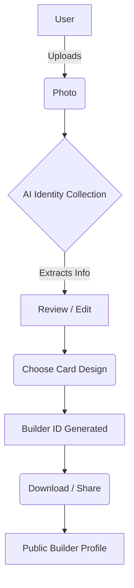

# Hacker House Goa 2026 — Builder ID Generator

An AI-assisted Builder Identity generator that creates personalized, beautifully designed ID cards for Hacker House Goa 2026.

## 🏠 Hacker House Goa 2026
This project was built for the Hacker House Goa 2026 shortlisting task. It showcases a modern, AI-integrated workflow to automatically generate and stylize a builder's public profile card.

---

## 📖 Project Overview

The Builder ID Generator helps developers effortlessly create a personalized Hacker House Goa identity card through an AI-assisted flow.

Users can:
- Upload or capture a photo
- Let the AI extract their professional information
- Review and manually refine the extracted details
- Generate a creative Builder Title
- Choose a distinct card style
- View an automatically framed profile photo (with manual adjustment and replacement options)
- Preview both the front and back of the generated card in an interactive 3D flip view
- Download the final ID card
- Broadcast the card to X (formerly Twitter)
- Generate a unique QR code linked to a public profile page

---

## ✨ Features

### AI-Assisted Identity
- **Conversational Information Collection:** AI seamlessly guides the user to collect missing details.
- **Builder Title Generation:** Automatically crafts a unique role title based on the developer's background.

### Photo Experience
- **Upload & Capture:** Support for standard photo uploads and direct camera capture.
- **Smart Framing:** AI subject detection automatically frames the subject.
- **Adjust & Replace:** Users retain manual control to tweak or replace the photo.

### Builder ID System
- **Multiple Designs:** Choose from **Editorial**, **Terminal**, or **Goa** styles.
- **Front & Back Cards:** Each style features distinct front and back visuals.
- **Interactive Flip:** A 3D flip preview to inspect both sides of the card.
- **Stack Limit:** Showcases a maximum of 5 core technologies.
- **Manual Editing:** Override AI-generated details at any time.

### Sharing
- **Public Share Pages:** Unique `/share/{id}` URL for every generated card.
- **QR Code:** Easily accessible via a generated QR code linking to the share page.
- **X Broadcast:** Quick integration to share the public ID on X.
- **OpenGraph Ready:** The public page renders the card for social previews.

---

## ⚙️ How It Works



---

## 🛠 Tech Stack

| Technology | Purpose |
|---|---|
| Next.js | Core application framework (App Router) |
| React | UI library |
| TypeScript | Type safety and tooling |
| Tailwind CSS | Utility-first styling |
| OpenAI SDK | AI identity collection & image analysis |
| Vercel Blob | Storage for public shared profile images |
| html-to-image | Client-side DOM to image rendering |
| Framer Motion | Smooth UI animations and card flipping |
| react-qr-code | Generating shareable QR codes |
| Sharp | Image optimization |

---

## 📐 Architecture

The application is built around several core technical pillars:
- **Next.js App Router:** Handles the server-side logic, API routes, and routing structure.
- **AI Integration:** Uses OpenAI to validate uploaded photos, perform subject cropping, and interactively extract developer information.
- **Client-side Card Rendering:** Leverages DOM manipulation to render complex React components (Front/Back cards) into downloadable images using `html-to-image`.
- **Blob Storage:** Uses `@vercel/blob` to persistently store card images for public sharing.
- **Public Sharing:** Dynamic Next.js routes (`/share/[id]`) provide accessible profiles without requiring user authentication.

---

## 🎨 Card System & Design Philosophy

The visual direction embraces the **Hacker House Goa** branding: a dark hacker/terminal aesthetic accented with vibrant yellow and secondary pink colors. The layouts are bold, responsive, and builder-focused.

The system provides three distinct styles, each with tailored front and back treatments:
1. **Editorial:** Clean, magazine-like typography.
2. **Terminal:** Developer-focused, code-editor aesthetic.
3. **Goa:** Vibrant, neon-infused cinema style.

---

## 🖼 Photo Processing Pipeline

1. **Upload / Capture:** User provides an image.
2. **Client Validation:** Verifies size and MIME type.
3. **AI Subject Detection:** The OpenAI Vision API determines if a clear humanoid subject exists and returns a bounding box.
4. **Automatic Framing:** The application calculates a smart 4:5 portrait crop based on the AI bounding box.
5. **Adjust/Replace:** Users can manually override the crop or swap the image.

---

## 🔗 Sharing System

When a user decides to share their card:
1. The client-side rendered image is uploaded to Blob storage.
2. A unique share ID is generated.
3. The public URL is formatted as `https://[domain]/share/{shareId}`.
4. The QR code on the physical card points directly to this URL.
5. **No authentication is required** for visitors to view the public profile.

---

## 📁 Project Structure

```text
src/
├── app/                  # Next.js App Router (pages, API routes, share route)
├── components/           # React components
│   ├── builder/          # Core builder flow (Photo, Identity, Design, Result)
│   │   └── cards/        # Front & Back card design implementations
│   ├── ui/               # Reusable UI elements
│   └── upload/           # Photo upload components
├── lib/                  # Utilities (AI actions, image processing, sharing logic)
└── types/                # TypeScript type definitions
```

---

## 🚀 Getting Started

To run this project locally:

```bash
git clone <repository-url>
cd my-goa-generator
npm install
npm run dev
```

The application will be available at `http://localhost:3000`.

---

## 🔐 Environment Variables

Create a `.env.local` file in the root directory.

| Variable | Purpose |
|---|---|
| `OPENAI_API_KEY` | Required for AI identity extraction and image validation |
| `BLOB_READ_WRITE_TOKEN` | Required by Vercel Blob to store public share images |
| `BLOB_STORE_ID` | Alternative to the token for Vercel Blob configuration |
| `NEXT_PUBLIC_SITE_URL` | Base URL for sharing links in cards |

---

## 🏗 Build & Deployment

### Build
To create a production build:
```bash
npm run build
```

### Deployment
This project is optimized for deployment on Vercel. Connect your repository to Vercel, ensure the environment variables are set in the Vercel dashboard, and Vercel will automatically build and deploy the Next.js application.

---

## 👥 Team

- **Vansh** — AI / Full-Stack Development, AI integration, UI/UX
- **Sujal** — Backend Engineer
- **Manthan** — Hardware Engineer

---

## 🌟 My Contribution (Vansh)

As the primary Full-Stack Developer for the application layer, my contributions focused on:
- Architecting the Next.js App Router structure and implementing the full user interface.
- Designing the UI/UX flow and translating the Hacker House Goa aesthetic into interactive components.
- Integrating OpenAI to power the conversational identity extraction and intelligent image subject cropping.
- Building the complex client-side card rendering pipeline that seamlessly switches between Editorial, Terminal, and Goa designs.
- Implementing the comprehensive photo workflow (upload, crop, replace).
- Engineering the public sharing experience, integrating Vercel Blob storage, dynamic routes, and OpenGraph metadata generation.

---

## 🔮 Future Improvements

- **Interactive 3D Elements:** Add tilt/gyroscope effects to the cards in the browser.
- **Custom Fonts:** Allow users to switch typography themes within the chosen style.
- **Extended Tech Stack Options:** Implement a search-and-select dropdown for a wider variety of recognized technologies.

---

## 📄 License

This repository currently does not specify a license.
